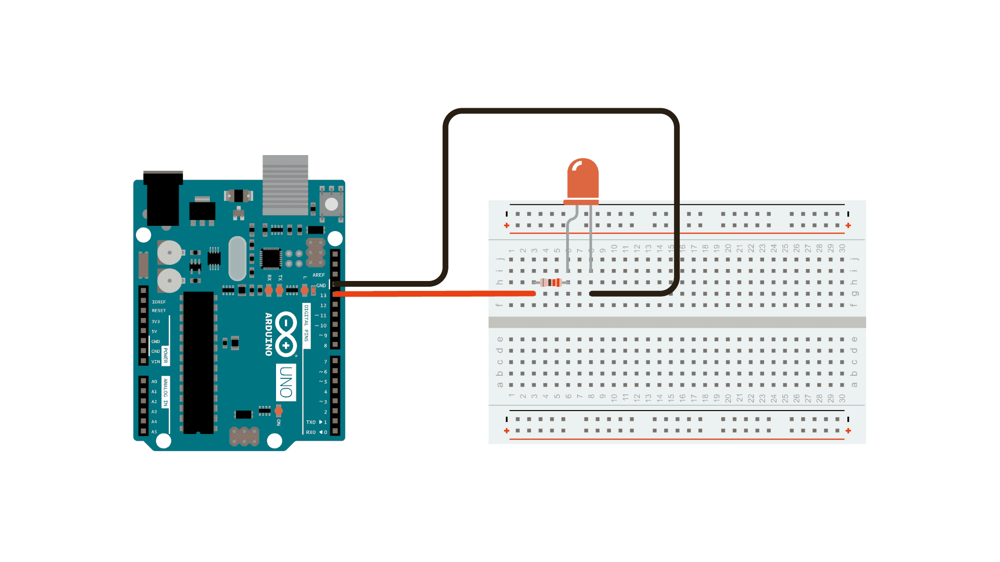
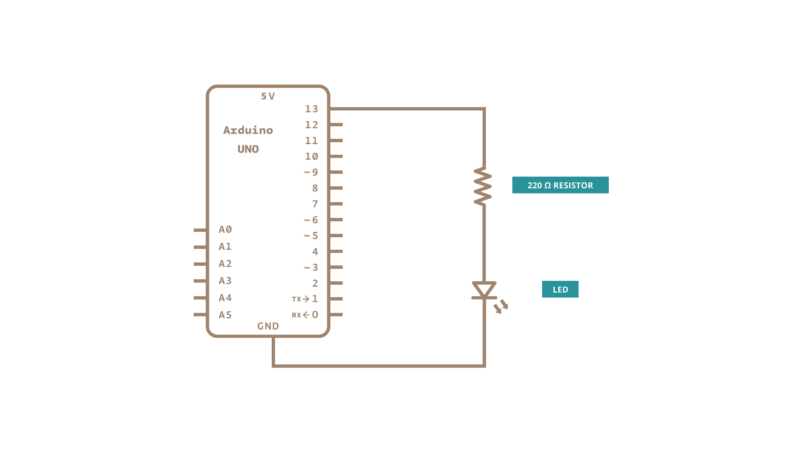

# Project: Blink an LED

The hello world of physical computing: make an LED blink from code on a microcontroller.
You can connect the LED directly to power and ground, using a resistance in the circuit to keep the voltage low enough not to explode the light.
Starting with a breadboard can make this setup simpler.

## Build Reference

Breadboard layout for the blink circuit.

 Schematic for an LED and resistor connected to a microcontroller pin

## You can move on when you can...

- LED blinks at a rate you control from code
- Bonus: button press changes the blink pattern (uses Logic Gates thinking)

## Resources

- [Microcontroller Basics Playlist - Back To Engineering](https://www.youtube.com/playlist?list=PLA91EvK7Dr_uZfC8QRWU6ETB3tA66958w)
- [Blink an LED Arduino Docs](https://docs.arduino.cc/built-in-examples/basics/Blink/)

## Iulia's Hardware Picks
--8<-- "affiliate-disclosure.md"

- [Arduino starter kit](https://amzn.to/458MMrG)
- [Raspberry Pico Starter Kit](https://amzn.to/4aWZL34)
