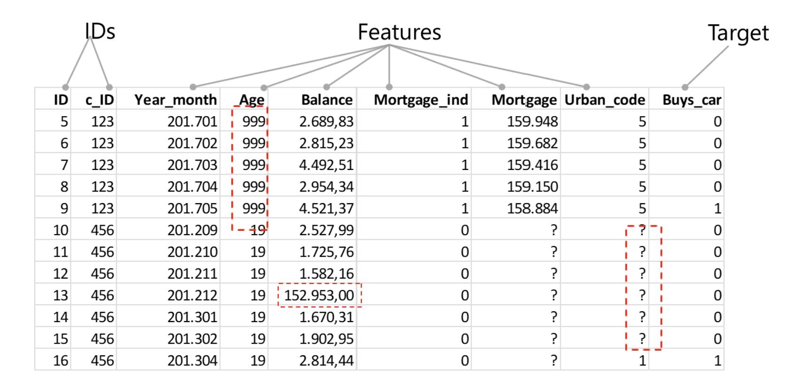

# Data Fundamentals

Every model you will ever train sits on top of data. Before you can predict
anything, classify anything, or teach a robot anything, you need to understand
what data actually is, what shape it comes in, and whether the data you have can
answer the question you are asking.

## You are already inside the data

You do not need a career in data science for this to be relevant. If you used
maps to get somewhere today, scanned a loyalty card, opened almost any app,
watched something on Netflix, ordered from Amazon, or played a song on Spotify,
you generated data and were served the output of a model. Right now the YouTube
algorithm is deciding what to show you next.

Companies use this data to understand behaviour, predict what you might do next,
and shape a personalised version of the internet around you. Whether or not you
understand it, you are part of a lot of experiments every day. Learning how it
works is worth it for that reason alone.

## Where data comes from

Take one application and the sources multiply fast. For Netflix, the data
includes the movies themselves (every frame and the soundtrack), plus your
watch history, your profile, what you rated, how long you watched before
dropping off, which actors you gravitated toward, what you searched for, and
which thumbnail you clicked on. All of that is data, and all of it can feed a model.

## Not all data is created equal

You may have heard that data is the new oil, along with a lot of big statements
about storing as much of it as possible. In practice, volume matters far less
than quality and relevance.

The actors in a film and its genre are insightful: they carry information you
can act on. The percentage of blue pixels in one frame at one moment is data
too, but it probably will not help you recommend anything to anyone. Collecting
more of the wrong thing does not get you closer to an answer.

### Structured vs unstructured

**Structured data** is what most people picture when they hear the word: Excel
sheets, tables, databases. Rows and columns with names, where each row is one
entry. A movie catalogue with title, genre, and release year is structured, and
this is the format data scientists work with most.

**Unstructured data** is everything that does not fit neatly into a table. The
movie itself, for example. You can store a description or the pixels of every
frame, but there are no columns, and a lot of what you might say about an image
is subjective. Text, audio, images, and video all land here.

### Raw vs clean

**Raw data** comes straight from the source, as unprocessed as it gets. It
usually contains mistakes, duplicates, irrelevant fields, and gaps.

**Clean data** is what you get after fixing those problems, and it is what you
actually want to model on. In a movie table, the problems might be a missing
release year, a year that is obviously wrong, or the same film appearing twice
with conflicting information.

### Ethics, privacy, and access

A public catalogue of films is one thing. Your personal viewing history, the
time of day you watch, and the scene you keep replaying is another. That data
says something about you, and you are probably the only person who should own
it. Nobody wants to open an app and see "you watched this 235 times today."

Different data carries different levels of sensitivity, different rules about
access, and different answers to the question of whether it can be shared at
all. Ask that question early, not after you have built something.

## Anatomy of a dataset

Once your data is in a table, it splits into three roles:

- **IDs** identify the row or the entity (a customer id, a transaction id).
  They are labels, not signal, and generally should not be fed to the model as
  features.
- **Features** are the columns you learn from: age, balance, whether there is a
  mortgage, and so on.
- **Target** is the column you are trying to predict.

The same table is also where data quality problems become visible. A few
classics worth learning to spot:

- **Placeholder values pretending to be real.** An age of `999` is not a
  person, it is whatever the system wrote when the value was missing. Left
  alone, it will quietly wreck any average you calculate.
- **Outliers and unit errors.** A balance of `152.953,00` sitting among values
  around `2.000,00` is either a genuine outlier worth investigating or a decimal
  separator that went wrong somewhere upstream.
- **Missing values.** Empty cells and question marks need a decision: fill them,
  flag them, or drop the rows. Doing nothing is also a decision, usually a bad one.

## Why this matters for robotics

Everything above applies directly once you start building robots that learn.
A teleoperation dataset for a robot arm is just data with the same problems in
different clothes: dropped frames instead of missing cells, a badly calibrated
sensor instead of a placeholder age, demonstrations that all start from the same
position instead of a biased sample. A policy trained on narrow or dirty
demonstrations fails in exactly the way a model trained on bad tabular data
fails. The habits you build here carry all the way to the robot.

## Resources

- [Add your favourite intro to data resources here via PR]

## You can move on when you can...

Before moving on to building anything, work through this:

1. **What kind of data do you have?** Structured or unstructured, raw or clean.
2. **Where does it come from?** Do you have access to it? Is it public,
   internal, or sensitive?
3. **Is it clean enough?** Missing values, duplicates, placeholders, obvious errors.
4. **Is it relevant to the question you are asking?** This is the one people
   skip. Data can be interesting, plentiful, and completely unable to answer
   your specific question. Data that recommends a film will not solve climate
   change.

## Next in the tree

Once you are comfortable with what data is and how to judge it, the next step is
turning it into predictions: **ML Fundamentals**.

