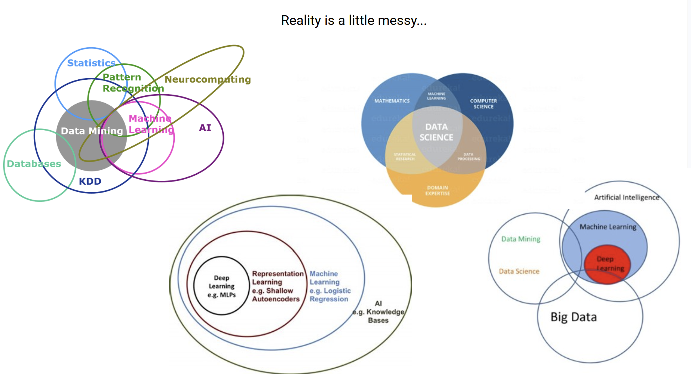
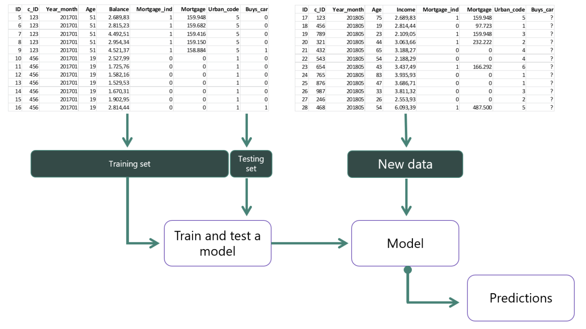
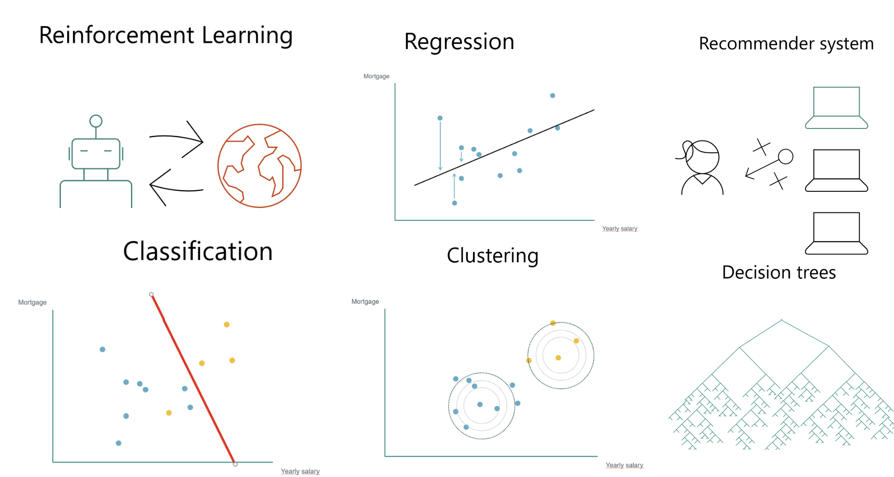

# ML Fundamentals

Data on its own only tells you what already happened. A model is how you get
something you did not already know from a table. This page covers what a machine
learning model is, how you train and test one, and the main families of models
you will meet.

## Data science, machine learning, and AI

Three words that get used interchangeably and are not the same thing:

- **Data science** is the broad field of studying data and pulling insight and
  information out of it, in whatever form it arrives.
- **Machine learning** is the study of algorithms and statistical models that
  predict something or take an action without being given explicit instructions
  for how to do it.
- **AI** is the bigger umbrella: an agent that acts on its environment based on
  what it observes, often using machine learning to do so.

The boundaries are fuzzy and depend on whose Venn diagram you are reading. Deep
learning, big data, and databases all get layered in as well. For learning
purposes, the three definitions above are enough.

## When do you need machine learning?

You need it when you cannot write the rules yourself.

Some problems are easy to model directly. Did you pass the test? You scored a 7,
the pass mark is 6, so yes. No machine learning required.

Now predict whether you will pass a test tomorrow. The test has not happened, so
the answer does not exist yet. What you do have is other information: hours
studied, results on previous tests in the subject, how well the material suits
you. You want a prediction from indirect signals, without anyone handing you the
formula. That is machine learning.

A useful warning built into that example: the prediction can change the outcome.
Predict a pass, study less because of it, and fail. Models sit inside the world
they are predicting.

## The two ingredients

**Data**, covered on the previous node, and **a goal**.

You cannot build a model that solves everything, that would be closer to
general AI. You build a model for a specific question, called your hypothesis:
"will this house sell", or "what will this house sell for". Some questions can
be answered with the data you have and some cannot, and learning to tell the
difference is most of the skill.

## Training, testing, and new data

Take the classic example: predicting house prices. You start with houses that
have already sold, with features like number of bedrooms, floors, size, and age,
plus the price each one fetched.

Here is the problem. If you train on all of them and then predict a price, you
have no way of knowing whether the prediction is any good. So you cheat, on
purpose:

1. **Training set.** Most of the sold houses. The model learns from these.
2. **Testing set.** A slice of sold houses you hold back and pretend you know
   nothing about. You do know the real prices, which is exactly the point: the
   model predicts, and you check its answers against the truth it never saw.
3. **Iterate.** If the model predicts 5 million for a house that sold for 4.5
   million, you decide whether that is close enough. You go back and forth,
   improving until performance is acceptable. What counts as acceptable is a
   judgement call, and it belongs to you, not the algorithm.
4. **New data.** Only then do you point the model at genuinely unseen data, like
   the house you are selling now, where nobody knows the answer yet. It returns
   a prediction, and you make a decision with it.

## Types of question, types of model

The question you ask determines the kind of model you need:

- **Classification** answers a question with a limited set of categories. Will
  this house sell, yes or no? Is this email spam? The output is a class.
- **Regression** predicts a number on a continuous range. What price will this
  house sell for, anywhere from a few thousand to several million? Enumerating
  every possible value as a class would be absurd, so you predict the number
  itself.

## The three families

Nearly every model falls into one of three categories.

### Supervised

**Task driven.** You have historical data where the answers are known, and you
learn from what already happened to predict what happens next. Both examples
above are supervised. This is the most common and the most approachable family
to start with.

### Unsupervised

**Pattern driven.** You want to understand what is going on inside your data
without knowing what you are looking for. The main example is **clustering**:
the model groups entries that behave similarly, without being told what the
groups mean.

The catch, and the interesting part, is that you may not understand why a
cluster exists. "Expensive houses" is a grouping a human recognises. A model may
find a pattern that is real, useful, and not obvious to the eye, and it will not
explain itself.

### Reinforcement

**Environment driven.** The model adjusts based on feedback, nudged toward good
outcomes and away from bad ones. Training a dog is the intuitive version. Games
are the classic technical one: nobody tells you the rules, you try moves, and
progressing to the next level tells you that was right while dying tells you it
was wrong. Over enough attempts you find your way to the goal without ever being
given instructions.

Underneath these families sit many specific models: decision trees, recommender
systems (the Netflix and YouTube example), neural networks, and many more. You
do not need all of them to start. You need to recognise which family your
problem belongs to.

## Why this matters for robotics

These three families map directly onto how robots learn. Supervised learning is
behind the perception stack, a camera classifying what it sees. Imitation
learning, where you teleoperate an arm and train a policy on your own
demonstrations, is supervised learning with your recorded actions as the labels.
Reinforcement learning is how policies get trained in simulation, where a robot
can fail thousands of times cheaply before touching real hardware. The
train/test discipline matters even more here, because a policy that performs
perfectly on the positions it was trained on and fails on a new one is the
robotics version of a model that memorised its training set.

## Resources

- [Add your favourite intro to ML resources here via PR]

## You can move on when you can...

- Train a classifier and evaluate it on a held-out test set
- Explain why you never tune on the test set
